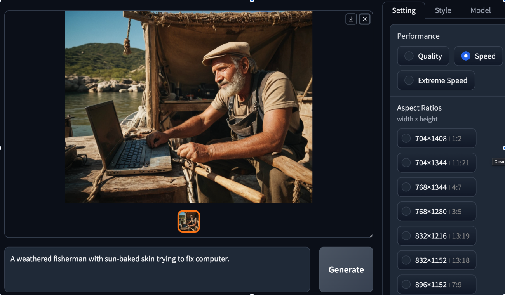
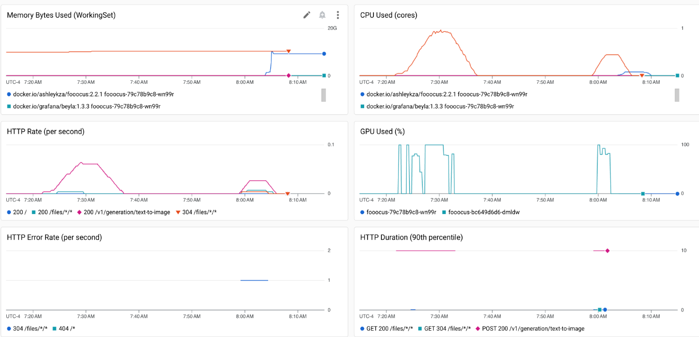

# gke-ai-observability

Demo of observability setup for AI workloads on GKE




https://github.com/lllyasviel/Fooocus

## Fooocus Observability Demo

1. Create GKE cluster e.g. standard one in e.g. us-central1 region.

   ```bash
   bash fooocus/1-patched.sh
   ```
   
   Then follow up with the pool: 

   ```bash
   bash fooocus/2.sh
   ```

2. After cluster is up, setup kubectl

    ```bash
    gcloud container clusters get-credentials ${CLUSTER_NAME} --location=${REGION}
    ```

3. Add more observability (soon will be automatic with monitoring packages)

   ```bash
   # DCGM exporter, will be automatically done for you soon with DCGM package.
   kubectl apply -f fooocus/dcgm-monitoring.yaml
   # Same here, should be part of KUBELET,CADVISOR soon.
   kubectl apply -f fooocus/gcm-cadvisor.yaml
   ```
   
4. Install Fooocus inference server on your cluster, instrumented for HTTP metrics with eBPF
   
   If you want UI (without REST API):

    ```bash
    kubectl apply -f fooocus/server-instrumented-ui.yaml
    ```

   If you want without UI (REST API), see `fooocus/stress.sh` on how to access it.

    ```bash
    kubectl apply -f fooocus/server-instrumented-rest.yaml
    ```

5. Wait for it to come up, in the meantime you can check the logs:

   ```bash
   kubectl logs -f -l app=fooocus
   ```
   
Unfortunately it's configured to download GBs (in total) of deps and models on start.
   
6. Setup port-forwarding

   For UI:

   ```bash
   kubectl port-forward service/fooocus 3000:3000
   ```
   
   For REST:

   ```bash
   kubectl port-forward service/fooocus 3000:8088
   ```

7. Open 3000 port
8. Enjoy, create your own dashboard or e.g. [import Grafana dashboard](https://cloud.google.com/monitoring/dashboards/import-grafana-dashboards?_gl=1*aklqpu*_ga*MTQ0MjU0NTc5LjE3MDU2OTg1OTc.*_ga_WH2QY8WWF5*MTcxMDIzOTEwOS4xNi4wLjE3MTAyMzkxMDkuMC4wLjA.&_ga=2.5155379.-144254579.1705698597) like https://grafana.com/grafana/dashboards/12239-nvidia-dcgm-exporter-dashboard/ into the GCM
